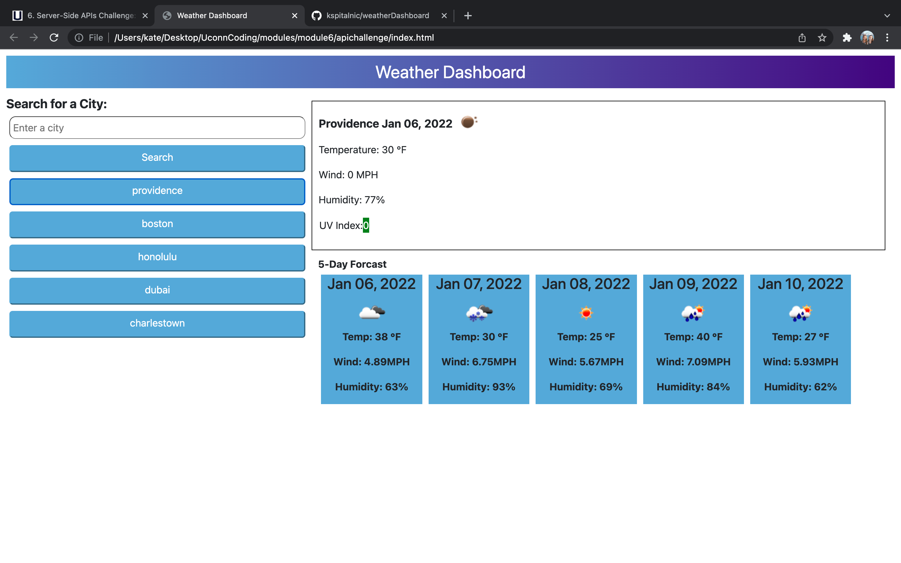

# Weather Dashboard 
This web application allows a user to enter a city name and displays the current weather of that location to the user through the utilization of third-party APIs.

## USER STORY 
AS A traveler
I WANT to see the weather outlook for multiple cities
SO THAT I can plan a trip accordingly

## Project Aims
* displays a card with information on the current weather at the inputted city. 
* displays a five day forecast for that location as well. 
* saves searches to local storage, and gets them from local storage to create a button to view cities that have already been viewed, even upon page refreshing. 

## Strategies Used 
* HTML, CSS, JavaScript
* Local storage, third-party APIs, bootstrap

<a href="https://kspitalnic.github.io/weatherDashboard/">Link to Website </a>
 
<a href="https://github.com/kspitalnic/weatherDashboard">Link to Repository </a>
 

Screenshot:  